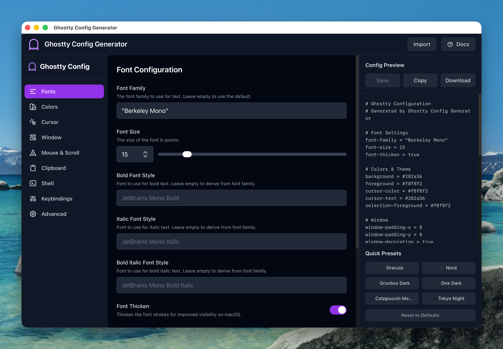

# Ghostty Config Generator

A desktop GUI for creating, editing, and managing [Ghostty](https://ghostty.org) terminal emulator configuration files. Built with Tauri v2, React, and TypeScript.

The app reads your `~/.config/ghostty/config` on startup and writes to it when you click Save. No cloud, no accounts — everything stays on your machine.



## Features

- Visual controls for 90+ Ghostty config options across 9 categories (fonts, colors, cursor, window, mouse/scroll, clipboard, shell, keybindings, advanced)
- Live config preview as you make changes
- Import existing config files via native file dialog
- Built-in color theme presets (Dracula, Nord, Gruvbox Dark, Solarized, Tokyo Night, and more)
- Copy to clipboard or download as file
- Unsaved changes indicator

## Prerequisites

- [Node.js](https://nodejs.org) (v18+)
- [Rust](https://rustup.rs) (stable)
- Tauri v2 system dependencies — see the [Tauri prerequisites guide](https://v2.tauri.app/start/prerequisites/)

## Development

```bash
npm install
npm run tauri:dev
```

This starts the Vite dev server and launches the Tauri window with hot reload.

## Build

```bash
npm run tauri:build
```

Produces a native application bundle in `src-tauri/target/release/bundle/`.

## Usage

1. Launch the app — if `~/.config/ghostty/config` exists, your current settings are loaded automatically
2. Adjust settings using the GUI controls
3. Click **Save** to write the config file
4. Press **Cmd+Shift+,** in Ghostty to reload the config

## Tech Stack

- **Frontend:** React 18, TypeScript 5, Vite 5, Tailwind CSS 3
- **Desktop:** Tauri v2 (Rust backend, WebView frontend)
- **Plugins:** `tauri-plugin-fs` (file read/write), `tauri-plugin-dialog` (native file picker)

## Project Structure

```
src/
  components/
    ConfigSections/   # One component per config category
    Controls/         # Reusable form inputs (text, number, toggle, select, color picker, etc.)
    Layout/           # Sidebar, MainContent, PreviewPanel
  context/            # React Context + useReducer state management
  data/               # Config schema defaults and theme presets
  types/              # GhosttyConfig interface and enums
  utils/              # Config generator, parser, and Tauri filesystem helpers
src-tauri/            # Tauri v2 Rust backend and configuration
```

## License

MIT
